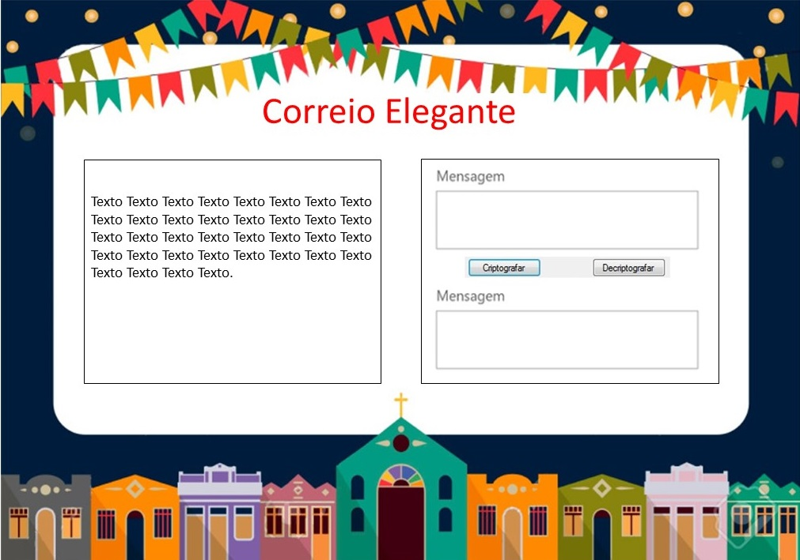

# Correio Elegante 
É uma brincadeira típica de **Festas Juninas** em que uma pessoa envia uma mensagem para ser entregue a outra pessoa.

## Índice

* [1. Introdução](#1-Introdução)
* [2. Objetivo](#2-Objetivo)
* [3. Tema](#3-Tema)
* [4. Desenvolvimento](#4-Desenvolvimento)
* [5. Utilização](#5-Utilização)
* [6. Ferramentas Utilizadas](#6-Ferramentas-Utilizadas)
* [7. Linguagens Utilizadas](#7-Linguagens-Utilizadas)

***

## 1. Introdução

Primeito projeto desenvolvido utilizando a *Cifra de César*.

A cifra de Cesar é uma das mais simples e conhecidas técnicas de criptografia. 
É um tipo de cifra de substituição na qual cada letra do texto é substituída por outra representada no mesmo alfabeto. 
A substituição ocorre alterando a posição definida.

Por exemplo para que a substituilção ocorra no valor de 3 posições teriamos:
Texto Normal: ABCDEFGHIJKLMNOPQRSTUVWXYZ
Texto Cifrado: DEFGHIJKLMNOPQRSTUVWXYZABC

## 2. Objetivo

Desenvolvido para codificar e descodificar mensagens românticas, de amizade ou apenas de brincadeiras durante as **Festas Juninas**.

## 3. Tema

No Brasil, as festas juninas foram introduzidas pelos portugueses no período colonial, sofreu algumas variações em diferentes estados do Brasil, mas existem algumas tradições que não mudam, como por exemplo:

* Comidas típicas especialmente feitas à base de milho e de amendoim: milho assado, curau, canjica, amendoim torrado, cuscuz, pamonha, bolo de milho, paçoca, arroz doce, cocada, maçã do amor.
* Apresentações: Quadrilha.
* Fogueira: dançar ao redor da fogueira, pular por cima do fogo.
* Bandeirinhas: usadas para decoração.
* Roupas caipiras: xadrex e coloridas.

As brincadeiras juninas são elementos essenciais de um bom "arraiá". 
Presentes em todas as festas juninas, elas podem variar de região para região.

Alguns tipos de brincadeiras que ocorrem nas Festas Juninas:

* **Correio elegante**,
* Pescaria,
* Cadeia,
* Argolas,
* Cabo de guerra,
* Corrida do saco.

## 4. Desenvolvimento

### Etapas seguidas

* Escolha do tema,
* Criação Layout,
* Estruturação Inicial: HTML, JavaScript, CSS,
* Estudos: Manipulação de DOM, Lógica da Cifra, Loop For,
* Elaborar as Funções dentro do código,
* Utilizar nomes de facil entendimento,
* Melhora na estruturação HTML e CSS,
* Corrigir erros,
* Testes de funcionalidade,
* Readme.

### Layout

## 5. Utilização

Para acessar a aplicação [Clique Aqui](https://gabrielasilva1991.github.io/SAP005-cipher/)

### Criptografar

* Digite a mensagem;
* Escolha o número da chave de descocamento;
* Clique no botão Criptografar,
* A mensagem criptografada será exibida.

### Descriptografar

* Digite a mensagem;
* Escolha o número da chave de deslocamento;
* Clique no botão Descriptografar,
* A mensagem original será exibida.

## 6. Ferramentas Utilizadas

* Visual Studio Code
* Git bash
* Node.js 
* GitHub
* GitHub Pages

## 7. Linguagens Utilizadas

* HTML5
* CSS3
* JavaScript

***